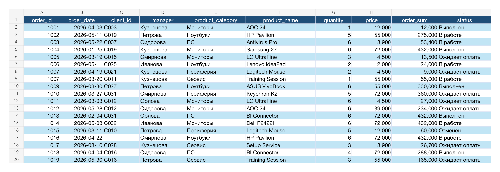
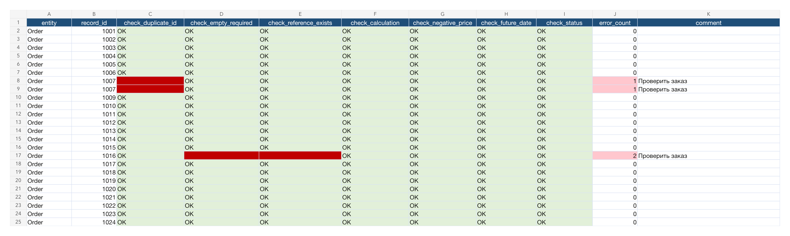
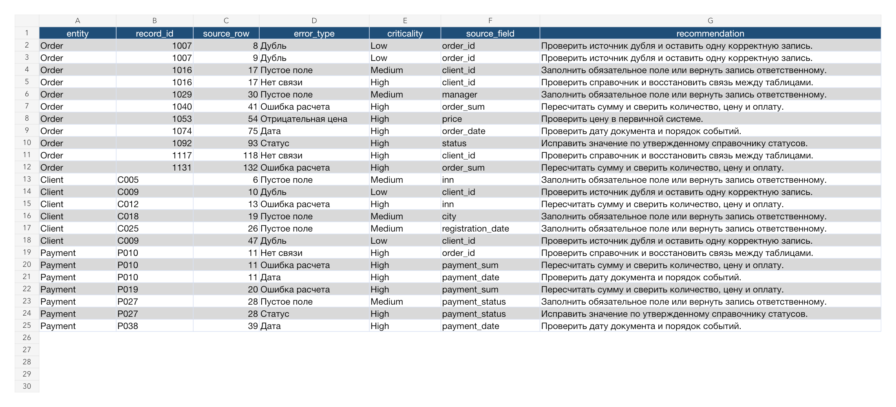
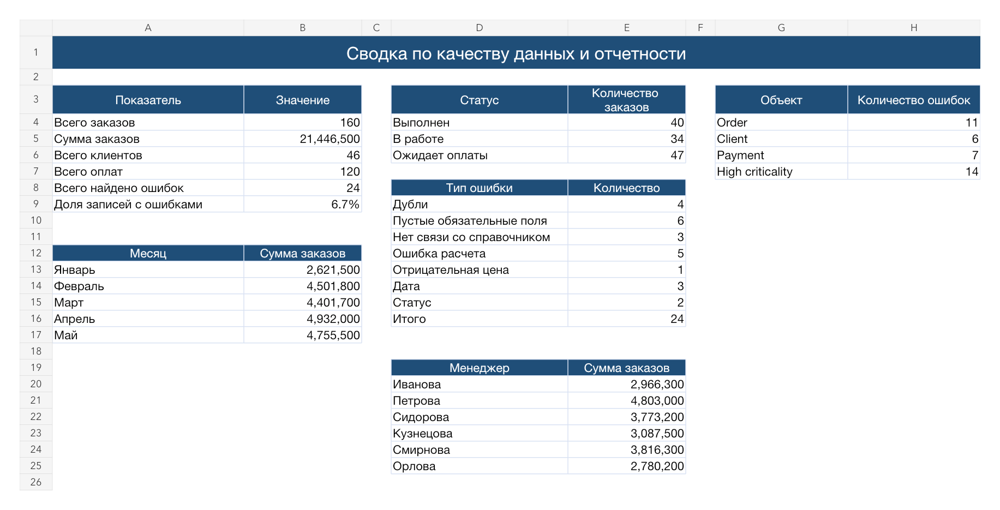
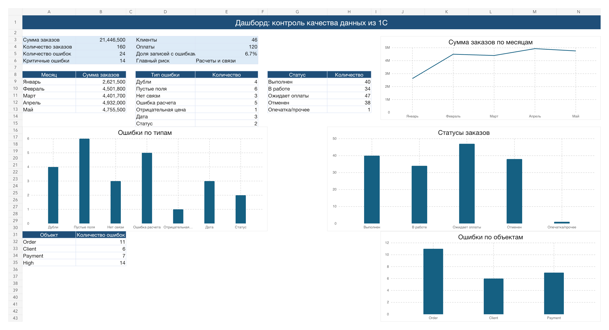
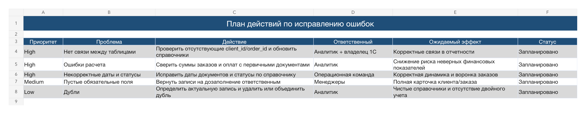

# Data Quality Control for 1C Exports

Контроль качества выгрузок из 1С и подготовка формульного Excel-отчета для регулярной управленческой отчетности.

## Краткое резюме

Кейс описывает контроль качества выгрузок из 1С и подготовку регулярного Excel-отчета для руководителя. Цель - быстро выявлять ошибки в заказах, клиентах и оплатах, оценивать критичность проблем и передавать бизнесу понятный план исправлений.

## Бизнес-ситуация

Компания ведет учет заказов, клиентов и оплат в 1С. При подготовке отчетности возникают ошибки: дубли, пропуски, некорректные суммы, неверные статусы и несвязанные записи.

## Бизнес-задача

Руководителю отдела продаж нужен регулярный контроль выгрузок из 1С перед подготовкой управленческой отчетности. Ошибки в заказах, оплатах и справочниках искажают сумму продаж, статус задолженности и качество операционных решений.

## KPI

| Показатель | Значение |
|---|---:|
| Проверяемые записи | 326 |
| Найденные события ошибок | 24 |
| Доля записей с ошибками | 6,7% |
| Критичные ошибки | 14 |
| Основной риск | расчеты и связи между таблицами |

## Состав проекта

- Синтетические выгрузки по заказам, клиентам и оплатам.
- Excel-файл с проверками качества данных.
- Формульные проверки, расчетные листы и итоговый дашборд.
- Реестр найденных событий ошибок.
- Краткие аналитические выводы.
- Скриншоты результата.

## Что сделано

- Подготовлены 3 выгрузки на синтетических данных: `orders_raw.xlsx`, `clients_raw.xlsx`, `payments_raw.xlsx`.
- Собран итоговый формульный файл `data_quality_report.xlsx`.
- Настроены проверки дублей, пустых обязательных полей, связей между таблицами, корректности расчетов, отрицательных цен, будущих дат и статусов.
- Добавлены листы с исходными данными, проверками, ошибками, сводкой и дашбордом.
- Добавлен компактный реестр ошибок с исходной строкой, типом, критичностью, полем-источником и рекомендацией.
- Добавлен план действий по исправлению ошибок.
- Подготовлены скриншоты итогового отчета.

## Результат

В реестре найдено 24 события ошибок в 326 проверяемых записях. Доля записей с ошибками - 6,7%. Из них 14 событий отмечены как критичные.

Основные типы ошибок:

- дубли идентификаторов;
- пустые обязательные поля;
- отсутствующие связи с клиентами или заказами;
- некорректные суммы;
- отрицательные цены;
- даты из будущего или даты оплаты раньше даты заказа;
- опечатки в статусах.

## Скриншоты

### Исходные данные

### Проверки качества данных

### Реестр ошибок

### Сводка

### Дашборд

### План действий

## Инструменты

Excel, формулы, расчетные листы, табличная модель, проверки качества данных, условное форматирование, диаграммы, управленческий дашборд.

## Структура

- `data/raw` - исходные синтетические выгрузки.
- `data/processed` - подготовленные данные.
- `docs` - правила проверок и описание логики.
- `result` - итоговые Excel-файлы.
- `screenshots` - скриншоты таблиц, проверок и дашборда.

## Файлы проекта

- `data/raw/orders_raw.xlsx` - исходная выгрузка заказов.
- `data/raw/clients_raw.xlsx` - исходная выгрузка клиентов.
- `data/raw/payments_raw.xlsx` - исходная выгрузка оплат.
- `result/data_quality_report.xlsx` - итоговый Excel-отчет.
- `docs/data_quality_rules.md` - правила проверок.
- `docs/formula_catalog.md` - каталог ключевых формул и расчетной логики.
- `docs/analytical_summary.md` - краткий аналитический вывод.

## Навыки, которые показывает проект

- работа с выгрузками из 1С;
- контроль качества данных;
- поиск дублей, пропусков, ошибок связей и расчетов;
- построение Excel-отчета с формульными проверочными и сводными листами;
- подготовка управленческого дашборда;
- оформление выводов и плана исправлений для бизнеса.

## Как открыть проект

1. Откройте `result/data_quality_report.xlsx`.
2. Посмотрите лист `07_dashboard` для общей картины.
3. Перейдите на `05_errors`, чтобы увидеть реестр найденных проблем.
4. Откройте `08_action_plan`, чтобы увидеть предложенные действия по исправлению.

> Для проверки формул и навигации по листам лучше открыть файл в Microsoft Excel или LibreOffice. GitHub preview не отображает Excel-книгу, формулы и диаграммы полноценно.

## Как описать в резюме

Подготовила аналитический кейс по контролю качества данных из 1С и регулярной отчетности в Excel. Сформировала синтетические выгрузки по заказам, клиентам и оплатам, настроила формульные проверки дублей, пропусков, некорректных сумм, статусов и связей между таблицами, собрала реестр ошибок, сводную аналитику, дашборд и план исправлений для руководителя.
