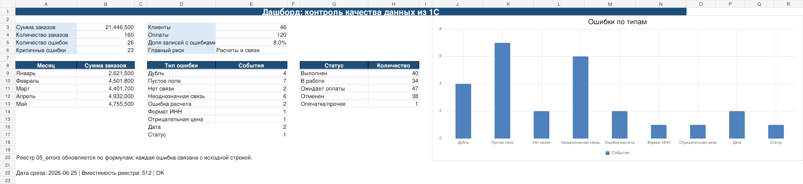

# Контроль качества выгрузок 1С в Excel

[English](README_EN.md)

Проверка собственных выгрузок автора: 160 заказов, 46 клиентов, 120 оплат. Исходные значения сохранены. Задача — найти дубли, обязательные пропуски, ошибки ссылок, сумм, формата ИНН, дат и статусов, затем передать исправления владельцу источника.

## Реализация

`result/data_quality_report.xlsx` содержит исходные таблицы, формульные проверки, динамический реестр событий, сводку, дашборд, план действий и параметры. `10_events` — вспомогательная таблица: каждое событие связано с объектом, исходной строкой и правилом. `05_errors` отбирает только ошибки по INDEX/MATCH и обновляется при изменении источника. KPI берутся из тех же событий; число событий и доля ошибочных записей — разные метрики.

Если ссылка отсутствует или соответствует нескольким ID, зависимая проверка суммы/даты оплаты получает SKIP, а не выбирает первый заказ. Нулевая сумма оплаты допустима; пустота определяется отдельно. ИНН проверяется на 10/12 цифр, без контрольной суммы. Порог суммы 0,01 руб., дата среза 25.06.2026 находятся на `09_parameters`.

## Воспроизведение и обновление в Excel

1. Скачать `result/data_quality_report.xlsx` и открыть в настольном Excel.
2. **Формулы → Параметры вычислений → Автоматически**, затем **Ctrl+Alt+F9**.
3. Смотреть `07_dashboard`, `05_errors`, `08_action_plan`.
4. Для новой выгрузки очистить старые данные на трёх raw-листах **без удаления строк, заголовков и листов**. Вставить только значения под совпадающими заголовками.
5. Вместимость: 180 заказов, 66 клиентов, 140 оплат, 512 событий в компактном реестре. Проверять `09_parameters!B6`: OVERFLOW означает, что реестр неполон и вместимость нужно расширить до использования результата. Входные записи за указанными границами не проверяются; нельзя добавлять их молча.
6. Установить дату среза `09_parameters!B2`, пересчитать и сверить число входных записей со сводкой.

Для импорта по именам колонок есть новый вспомогательный модуль `vba/ImportExports.bas`. Сохранить копию книги как `.xlsm`; **Alt+F11 → File → Import File**, выбрать модуль; **Alt+F8 → ImportThreeExports → Run**. Выбрать файлы orders, clients, payments по порядку. Все три входа проверяются до записи; превышение вместимости и отсутствие колонок останавливают импорт. Исходники открываются только для чтения. Этот модуль не объявляется историческим рабочим внедрением; исполнение в Excel 2010 в данной среде не проверено.

## Проверяемый результат

На исходных 326 записях: **26 событий**, **26 ошибочных записей (7,98%)**, **23 события High**. Эти значения отличаются от прежних 24/14: реестр связан с формулами, неоднозначные связи выделены отдельно, а зависимые проверки не порождают лишние ошибки. Критичность — правило проекта, не измеренная величина ущерба.



Результат независимо сверялся по исходным значениям. В движке сборки проверены изменение обязательного поля, добавление заказа и ошибочный цифровой формат ИНН; после проверки исходные значения восстановлены. Кэш формул проверен на ошибки. Нативное поведение Excel 2010 и VBA требует проверки в настольном Excel.

## Техническая пересборка

`scripts/refresh_report.mjs` читает существующие raw XLSX и неизменяемый шаблон `templates/report_layout.xlsx`; исходные записи не генерируются. Даты raw-файлов форматируются без изменения значений. Скрипт использует Node.js и `@oai/artifact-tool`, доступность этого пакета нужна только для пересборки, не для обычного открытия и обновления книги. Команда при установленном пакете:

```bash
node --max-old-space-size=6144 scripts/refresh_report.mjs
```

Макет шаблона содержит старый пример структуры; единственный итоговый результат — `result/data_quality_report.xlsx`, входные значения всегда берутся из `data/raw`. Скрипт не заменяет ручное исправление ошибок в учётной системе. Даты, допустимые статусы и критичность можно согласовать под другой источник. Отчёт проверяет качество отдельных записей, не полную сверку накопительных оплат или исторической задолженности.
