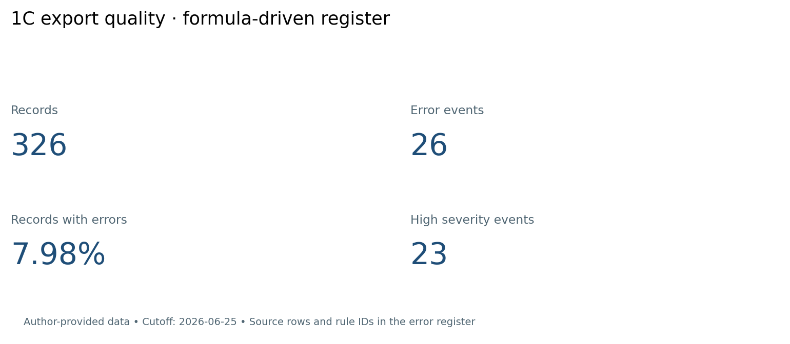

# Data quality checks for 1C exports in Excel

[Русский](README.md)

The author's own exports: 160 orders, 46 clients and 120 payments. Source values are preserved. The workbook checks duplicates, required fields, references, calculations, negative prices, dates, statuses and numeric INN format (10/12 digits; checksum not validated).

`04_checks` drives `10_events`; `05_errors` selects failures using INDEX/MATCH. Summary and dashboard use the same events. Missing or ambiguous order links cause dependent amount/date checks to SKIP rather than selecting the first match. Zero payment amounts are valid. Cutoff 2026-06-25 and money tolerance RUB 0.01 are explicit parameters.

Download `result/data_quality_report.xlsx`, enable automatic calculation and press Ctrl+Alt+F9. Replace raw-sheet values under matching headers without deleting rows or sheets. Limits: 180 orders, 66 clients, 140 payments and 512 displayed error events. Rows beyond source limits are not checked. An OVERFLOW indicator in `09_parameters!B6` means the register must be expanded before use. Reconcile source counts with the summary and set the reporting cutoff.

Current result: 326 records, 26 error events across 26 records (7.98%), 23 High events. High is a configured severity, not measured financial damage. Counts changed from the old static register because events now follow formulas and ambiguous references are explicit.

The new optional `vba/ImportExports.bas` imports by column name: save a workbook copy as .xlsm, import the module in Alt+F11, run ImportThreeExports via Alt+F8, then select orders/clients/payments. Inputs are opened read-only; all three are validated before writing; excess capacity is rejected. Native Excel 2010/VBA execution was not available in the validation environment.

The build engine and independent source-rule calculations were checked, including required-field and appended-order mutations. Technical rebuild: `node --max-old-space-size=6144 scripts/refresh_report.mjs`, requiring Node and an available @oai/artifact-tool package. Ordinary workbook usage needs neither. The script reads existing exports and a layout template, never generates source records. Payment checks are per record, not a complete reconciliation of cumulative payments or historical balances.

