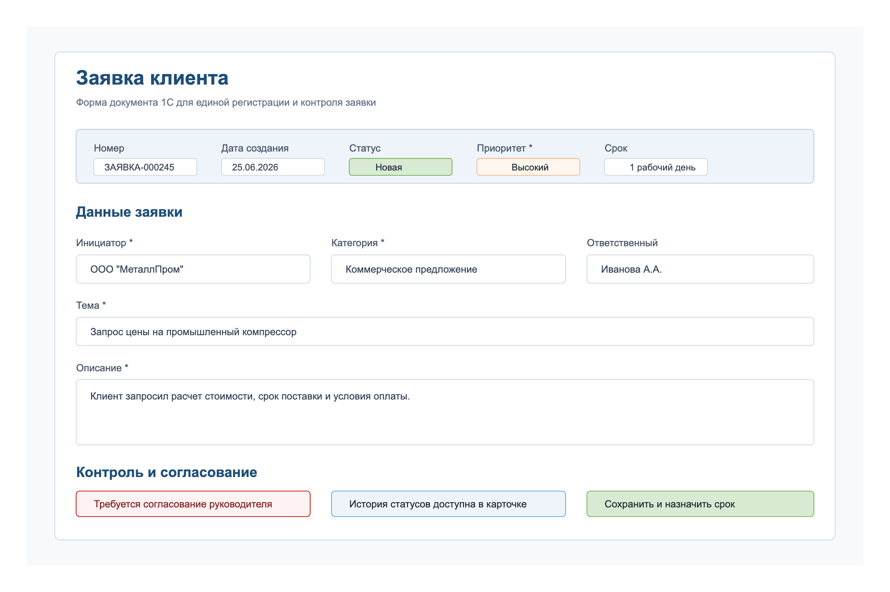

# Макет формы заявки

## Назначение

Макет показывает целевую форму заявки в 1С после улучшения процесса. Это не финальный дизайн интерфейса, а аналитический артефакт: он фиксирует поля, блоки и правила проверки для обсуждения с пользователями и командой 1С.

## Ключевые блоки

- шапка заявки: номер, дата создания, статус, приоритет;
- инициатор и контактные данные;
- детали заявки: категория, тема, описание;
- SLA и ответственный;
- блок согласования для высокого приоритета или нестандартных заявок;
- история статусов.

## Правила проверки

- обязательные поля отмечены символом `*`;
- заявку нельзя сохранить без инициатора, темы, категории, приоритета и описания;
- SLA рассчитывается автоматически после выбора приоритета;
- заявки высокого приоритета требуют согласования перед выполнением.

