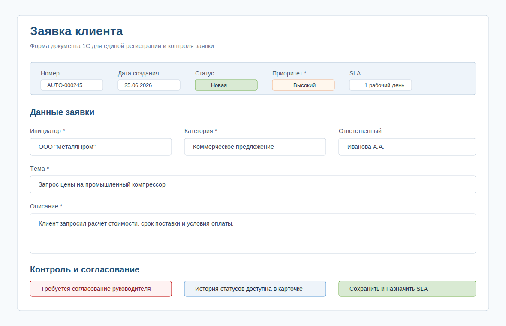

# Order Request Form Mockup

## Purpose

The mockup shows the target 1C request form after process improvement. It is not a final UI design; it documents fields, blocks and validation logic for discussion with users and the 1C development team.

## Key Blocks

- request header: number, creation date, status, priority;
- initiator and contact data;
- request details: category, topic, description;
- SLA and responsible person;
- approval block for high priority or non-standard requests;
- status history.

## Validation Rules

- required fields are marked with `*`;
- the request cannot be saved without initiator, topic, category, priority and description;
- SLA is calculated automatically after priority selection;
- high-priority requests require approval before execution.

