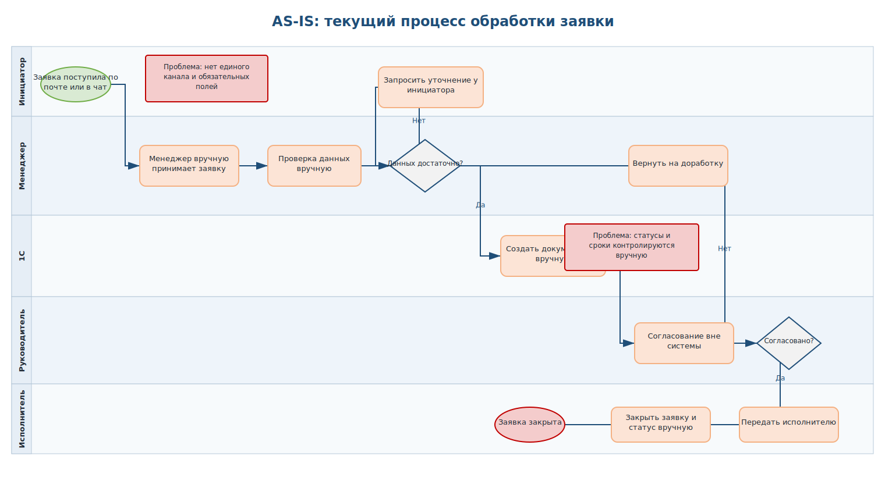
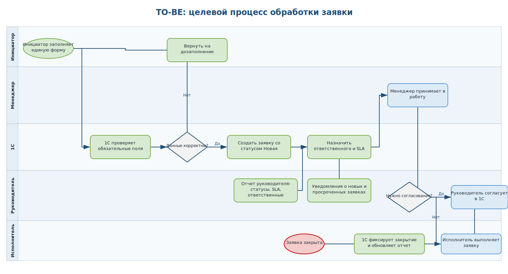

# 1C Business Process Improvement

## Описание

Проект показывает работу бизнес-аналитика с процессом обработки заявки: описание текущего процесса, поиск проблем, проектирование улучшенного процесса и подготовка требований на доработку 1С.

## Бизнес-ситуация

Заявки обрабатываются вручную, часть статусов заполняется некорректно, контроль сроков слабый, а руководителю сложно быстро увидеть узкие места процесса.

## Что сделано

- Описан текущий процесс обработки заявки AS-IS.
- Подготовлена BPMN-схема AS-IS в формате draw.io.
- Выявлены проблемы и узкие места процесса.
- Спроектирован улучшенный процесс TO-BE.
- Подготовлена BPMN-схема TO-BE в формате draw.io.
- Составлено техническое задание на доработку 1С.
- Подготовлена матрица требований с критериями приемки.
- Добавлен план внедрения улучшений.

## Скриншоты

### AS-IS процесс

### TO-BE процесс

## Инструменты

BPMN, draw.io, business analysis, requirements, process improvement, 1C.

## Файлы проекта

- `diagrams/as-is-process.drawio` - редактируемая BPMN-схема текущего процесса.
- `diagrams/to-be-process.drawio` - редактируемая BPMN-схема улучшенного процесса.
- `docs/business_context.md` - бизнес-контекст проекта.
- `docs/as_is_process.md` - описание текущего процесса.
- `docs/to_be_process.md` - описание целевого процесса.
- `docs/problems_and_improvements.md` - проблемы и предлагаемые улучшения.
- `docs/technical_specification.md` - техническое задание на доработку 1С.
- `docs/requirements_matrix.md` - матрица требований.
- `result/1c_improvement_case.md` - итоговое описание кейса для портфолио.

## Структура

- `docs` - описание процесса, требования и ТЗ.
- `diagrams` - BPMN-схемы.
- `result` - финальные документы.
- `screenshots` - изображения схем и ключевых страниц.

## Навыки, которые показывает проект

- описание бизнес-процессов AS-IS и TO-BE;
- выявление узких мест и ручных операций;
- моделирование BPMN-схем;
- подготовка требований к 1С;
- формулирование критериев приемки;
- перевод бизнес-проблемы в понятное техническое задание.

## Как описать в резюме

Подготовила портфолио-кейс по оптимизации процесса обработки заявок в 1С: описала текущий процесс AS-IS, выявила ручные операции и узкие места, спроектировала TO-BE-процесс, подготовила BPMN-схемы в draw.io, техническое задание и матрицу требований с критериями приемки.
