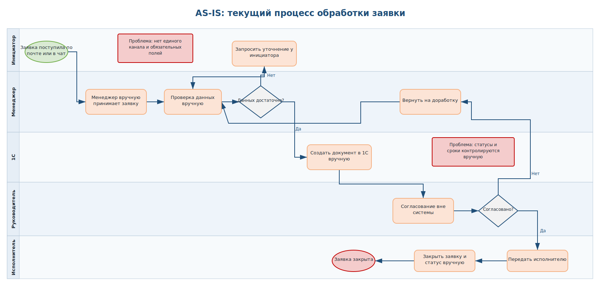
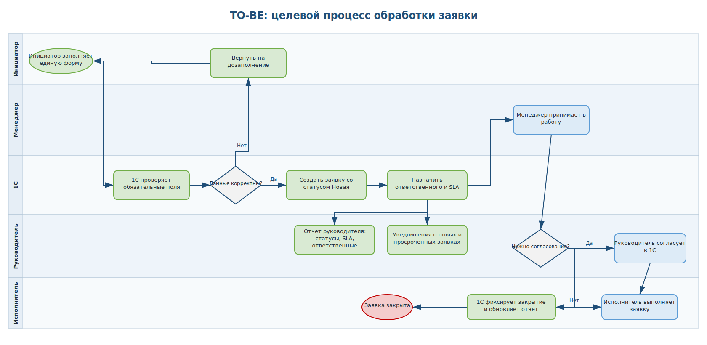
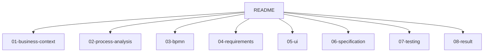

# 1C Order Request Process Automation

Смоделированный коммерческий кейс, основанный на типовых задачах бизнес-аналитика при автоматизации процессов в 1С.

## Business Case

ООО "ТехСнаб" продает промышленное оборудование и ежедневно обрабатывает около 200 клиентских заявок. Заявки поступают в почту, мессенджеры и через устные обращения менеджерам. Данные переносятся в 1С вручную, статусы ведутся нерегулярно, а руководитель отдела продаж не видит оперативную картину по просрочкам и загрузке сотрудников.

Цель проекта - описать текущий процесс, выявить узкие места и подготовить пакет аналитических артефактов для доработки 1С.

## Project Story


## Company Context

| Параметр | Значение |
|---|---|
| Компания | ООО "ТехСнаб" |
| Сфера | Продажа промышленного оборудования |
| Сотрудники | 65 |
| ERP | 1С |
| Объем заявок | около 200 в день |
| Участники процесса | продажи, бухгалтерия, склад, руководитель отдела продаж |

## Stakeholders

| Группа | Представители | Интерес |
|---|---|---|
| Заказчик | Коммерческий директор | Снижение просрочек и прозрачная отчетность |
| Основные пользователи | Менеджеры продаж | Быстрое создание и ведение заявок |
| Смежные пользователи | Бухгалтерия, склад | Корректные данные для оплаты и отгрузки |
| Руководитель процесса | Руководитель отдела продаж | Контроль статусов, SLA и ответственных |
| Исполнитель | Команда 1С | Понятные требования и критерии приемки |

## Scope

### In Scope

- единая форма заявки в 1С;
- обязательные поля и проверки данных;
- статусы заявки;
- расчет SLA по приоритету;
- уведомления ответственным;
- согласование нестандартных заявок;
- отчет руководителя по статусам, просрочкам и ответственным.

### Out of Scope

- внедрение CRM;
- личный кабинет клиента;
- логистика и маршрутизация доставки;
- интеграции с внешними сайтами;
- финансовое планирование и бюджетирование.

## Project Timeline

| Неделя | Работы | Статус |
|---|---|---|
| 1 | Изучение бизнес-контекста и текущего процесса | Done |
| 2 | Интервью с пользователями и сбор проблем | Done |
| 3 | AS-IS BPMN и анализ узких мест | Done |
| 4 | TO-BE BPMN, scope и требования | Done |
| 5 | UI mockup формы заявки и ТЗ для 1С | Done |
| 6 | Acceptance criteria и тестовые сценарии | Done |

## Deliverables

| Deliverable | File |
|---|---|
| AS-IS BPMN | [03-bpmn/as-is.drawio](03-bpmn/as-is.drawio) |
| TO-BE BPMN | [03-bpmn/to-be.drawio](03-bpmn/to-be.drawio) |
| Business Requirements | [04-requirements/business-requirements.md](04-requirements/business-requirements.md) |
| Functional Requirements | [04-requirements/functional-requirements.md](04-requirements/functional-requirements.md) |
| Non-Functional Requirements | [04-requirements/non-functional.md](04-requirements/non-functional.md) |
| User Stories | [04-requirements/user-stories.md](04-requirements/user-stories.md) |
| Technical Specification | [06-specification/technical-specification.md](06-specification/technical-specification.md) |
| UI Mockup | [05-ui/order-form.md](05-ui/order-form.md) |
| Acceptance Criteria | [07-testing/acceptance-criteria.md](07-testing/acceptance-criteria.md) |
| Test Scenarios | [07-testing/test-scenarios.md](07-testing/test-scenarios.md) |

## BPMN

### AS-IS процесс



### TO-BE процесс



## Document Map



## Repository Structure

```text
02-bpmn-1c-requirements
|-- README.md
|-- 01-business-context
|   |-- company.md
|   |-- scope.md
|   |-- stakeholders.md
|   `-- timeline.md
|-- 02-process-analysis
|   |-- interview-notes.md
|   |-- as-is-process.md
|   |-- problems.md
|   `-- to-be-process.md
|-- 03-bpmn
|   |-- as-is.drawio
|   |-- to-be.drawio
|   |-- as-is.svg
|   `-- to-be.svg
|-- 04-requirements
|   |-- business-requirements.md
|   |-- functional-requirements.md
|   |-- non-functional.md
|   |-- user-stories.md
|   `-- requirements-matrix.md
|-- 05-ui
|   |-- order-form.md
|   `-- order-form-mockup.svg
|-- 06-specification
|   `-- technical-specification.md
|-- 07-testing
|   |-- acceptance-criteria.md
|   `-- test-scenarios.md
`-- 08-result
    `-- project-summary.md
```

## Tools

BPMN, draw.io, business analysis, requirements management, process improvement, 1C, UI mockup, acceptance criteria.

## Resume Description

Подготовила смоделированный коммерческий кейс по автоматизации процесса обработки заявок в 1С: провела анализ AS-IS процесса, описала stakeholders и scope, выявила проблемы, спроектировала TO-BE процесс, подготовила BPMN-схемы в draw.io, business/functional requirements, user stories, UI mockup, техническое задание и критерии приемки.
