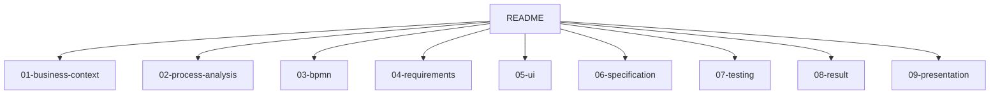

# 1C Order Request Process Automation

Смоделированный коммерческий кейс, основанный на типовых задачах бизнес-аналитика при автоматизации процессов в 1С.

## Как смотреть проект

Рекомендуемый порядок просмотра: бизнес-кейс -> AS-IS BPMN -> root cause analysis -> требования и RTM -> TO-BE BPMN -> UI mockup -> техническое задание -> критерии приемки.

## Бизнес-кейс

ООО "ТехСнаб" продает промышленное оборудование и ежедневно обрабатывает около 200 клиентских заявок. Руководитель отдела продаж заметил, что средний срок обработки заявки вырос с 1 до 3 дней, а менеджеры одновременно использовали почту, Excel и 1С. Из-за этого заявки терялись, статусы обновлялись вручную, а отчет по просрочкам собирался уже после возникновения проблемы.

Цель проекта - описать текущий процесс, выявить узкие места и подготовить пакет аналитических артефактов для доработки 1С.

## Исходные метрики

| Метрика | Текущее состояние |
|---|---|
| Сотрудники | 65 |
| Менеджеры продаж | 15 |
| Заявки в день | около 200 |
| Заявки с ошибками в данных | около 18% |
| Среднее время регистрации заявки | до 12 минут |
| Среднее время обработки заявки | до 3 дней |
| Подготовка ручного отчета | около 2 часов в неделю |

## История проекта


## Цели проекта

- снизить ручной ввод данных;
- сделать статус заявки прозрачным для менеджеров и руководителя;
- ускорить регистрацию заявки;
- исключить потерю заявок между почтой, Excel и чатами;
- упростить контроль SLA для руководителя отдела продаж.

## Критерии успеха

| Метрика | Было | Цель |
|---|---|---|
| Время регистрации заявки | до 12 минут | до 4 минут |
| Заявки с ошибками в данных | около 18% | менее 5% |
| Соблюдение SLA | около 85% | не менее 98% |
| Заявки без ответственного | возможны | 0% |
| Видимость статуса для руководителя | ручной отчет | онлайн в 1С |

## Контекст компании

| Параметр | Значение |
|---|---|
| Компания | ООО "ТехСнаб" |
| Сфера | Продажа промышленного оборудования |
| Сотрудники | 65 |
| Менеджеры продаж | 15 |
| ERP | 1С |
| Объем заявок | около 200 в день |
| Участники процесса | продажи, бухгалтерия, склад, руководитель отдела продаж |

## Stakeholders

| Группа | Представители | Интерес |
|---|---|---|
| Заказчик | Коммерческий директор | Снижение просрочек и прозрачная отчетность |
| Основные пользователи | Менеджеры продаж | Быстрое создание и ведение заявок |
| Смежные пользователи | Бухгалтерия, склад | Корректные данные для оплаты и отгрузки |
| Руководитель процесса | Руководитель отдела продаж | Контроль статусов, SLA и ответственных |
| Исполнитель | Команда 1С | Понятные требования и критерии приемки |

## Scope проекта

### In Scope

- единая форма заявки в 1С;
- обязательные поля и проверки данных;
- статусы заявки;
- расчет SLA по приоритету;
- уведомления ответственным;
- согласование нестандартных заявок;
- отчет руководителя по статусам, просрочкам и ответственным.

### Out of Scope

- внедрение CRM;
- личный кабинет клиента;
- логистика и маршрутизация доставки;
- интеграции с внешними сайтами;
- финансовое планирование и бюджетирование.

## Risks, Assumptions and Constraints

| Type | Key Points |
|---|---|
| Risks | users may continue using Excel; managers may resist process changes; migration of old requests may contain errors |
| Assumptions | company already uses 1C; client cards already exist; employees work in one internal environment |
| Constraints | no new CRM purchase; MVP inside 1C; release target is 2 months; no major database redesign |

## Project Timeline

| Период | Этап | Работы | Статус |
|---|---|---|---|
| 01.04-05.04 | Discovery | бизнес-контекст, текущие метрики, границы процесса | Done |
| 08.04-12.04 | Analysis | интервью, pain points, root cause analysis | Done |
| 15.04-19.04 | Design | AS-IS/TO-BE BPMN, architecture, use cases | Done |
| 22.04-26.04 | Requirements | BRD, FRD, RTM, user stories | Done |
| 29.04-03.05 | Validation | UI mockup, acceptance criteria, test scenarios | Done |
| 06.05-10.05 | Handover | technical specification and demo materials | Done |

## Deliverables

| Deliverable | File |
|---|---|
| AS-IS BPMN | [03-bpmn/as-is.drawio](03-bpmn/as-is.drawio) |
| TO-BE BPMN | [03-bpmn/to-be.drawio](03-bpmn/to-be.drawio) |
| Business Requirements | [04-requirements/business-requirements.md](04-requirements/business-requirements.md) |
| Functional Requirements | [04-requirements/functional-requirements.md](04-requirements/functional-requirements.md) |
| Non-Functional Requirements | [04-requirements/non-functional.md](04-requirements/non-functional.md) |
| User Stories | [04-requirements/user-stories.md](04-requirements/user-stories.md) |
| Requirements Register | [04-requirements/requirements-register.md](04-requirements/requirements-register.md) |
| Requirements Traceability Matrix | [04-requirements/requirements-traceability-matrix.md](04-requirements/requirements-traceability-matrix.md) |
| Technical Specification | [06-specification/technical-specification.md](06-specification/technical-specification.md) |
| UI Mockup | [05-ui/order-form.md](05-ui/order-form.md) |
| Acceptance Criteria | [07-testing/acceptance-criteria.md](07-testing/acceptance-criteria.md) |
| Test Scenarios | [07-testing/test-scenarios.md](07-testing/test-scenarios.md) |
| Demo Materials | [09-presentation/demo-outline.md](09-presentation/demo-outline.md) |

## BPMN

### AS-IS процесс


### TO-BE процесс


## Supporting Diagrams

### Solution Architecture


### Use Case Diagram


### Sequence Diagram


## Document Map



## Repository Structure

```text
02-bpmn-1c-requirements
|-- README.md
|-- 01-business-context
|   |-- company.md
|   |-- goals-and-kpi.md
|   |-- assumptions-and-constraints.md
|   |-- risks.md
|   |-- scope.md
|   |-- stakeholders.md
|   `-- timeline.md
|-- 02-process-analysis
|   |-- interview-notes.md
|   |-- as-is-process.md
|   |-- problems.md
|   |-- root-cause-analysis.md
|   `-- to-be-process.md
|-- 03-bpmn
|   |-- as-is.drawio
|   |-- to-be.drawio
|   |-- as-is.svg
|   |-- to-be.svg
|   |-- architecture.svg
|   |-- use-case.svg
|   `-- sequence.svg
|-- 04-requirements
|   |-- business-requirements.md
|   |-- functional-requirements.md
|   |-- non-functional.md
|   |-- requirements-register.md
|   |-- requirements-traceability-matrix.md
|   |-- user-stories.md
|-- 05-ui
|   |-- order-form.md
|   `-- order-form-mockup.svg
|-- 06-specification
|   `-- technical-specification.md
|-- 07-testing
|   |-- acceptance-criteria.md
|   `-- test-scenarios.md
|-- 08-result
|   |-- lessons-learned.md
|   `-- project-summary.md
`-- 09-presentation
    `-- demo-outline.md
```

## Tools

BPMN, draw.io, business analysis, requirements management, process improvement, 1C, UI mockup, RTM, acceptance criteria.

## Resume Description

Подготовила смоделированный коммерческий кейс по автоматизации процесса обработки заявок в 1С: провела анализ AS-IS процесса, описала stakeholders, scope, risks, assumptions и constraints, выявила root causes, спроектировала TO-BE процесс, подготовила BPMN-схемы в draw.io, RTM, business/functional requirements, user stories, UI mockup, техническое задание и критерии приемки.

## Lessons Learned

В ходе проекта были отработаны навыки описания бизнес-процессов, проведения интервью, выявления root causes, моделирования BPMN, подготовки требований, проектирования формы, написания ТЗ, формирования RTM и подготовки критериев приемки.
