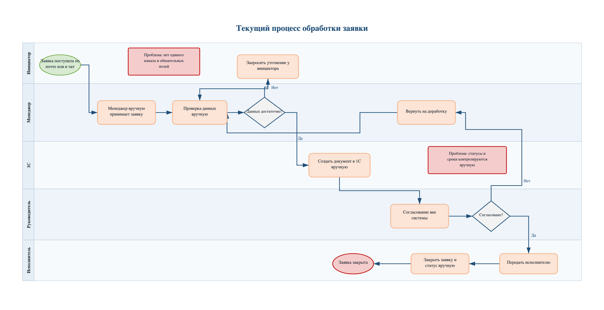
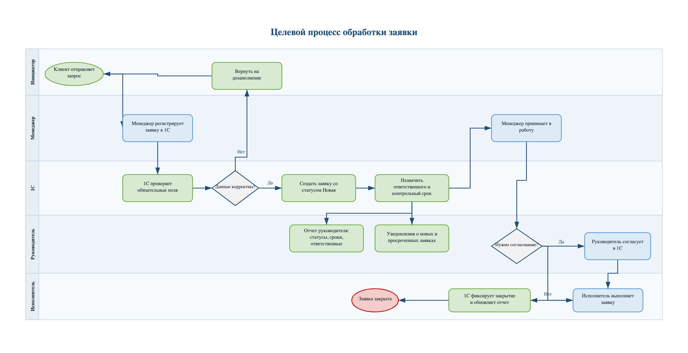
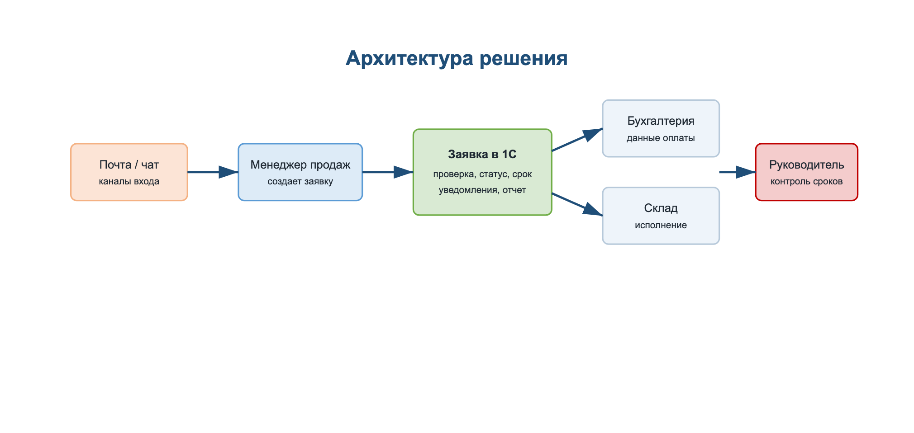
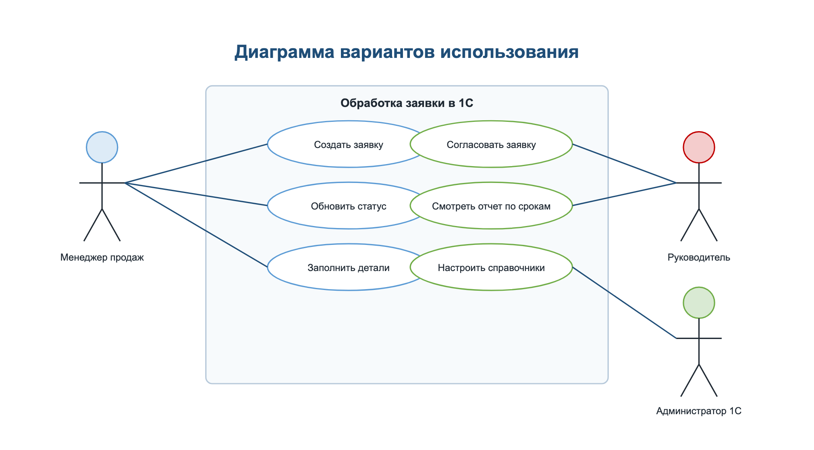
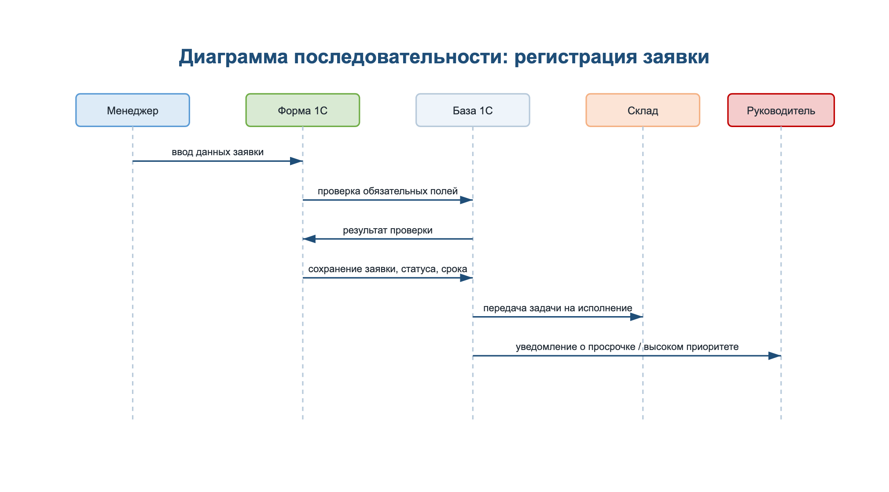
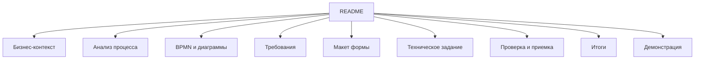

# 1C Order Processing Automation

Автоматизация обработки клиентских заявок в 1С: анализ AS-IS процесса, проектирование TO-BE процесса, требования, RTM, макет формы, ТЗ и критерии приемки.

Аналитический кейс на синтетическом бизнес-контексте, приближенный к типовой коммерческой задаче бизнес-аналитика при автоматизации процессов в 1С.

## Как смотреть проект

Рекомендуемый порядок просмотра: бизнес-кейс -> AS-IS BPMN -> анализ первопричин -> требования и RTM -> TO-BE BPMN -> макет формы -> техническое задание -> критерии приемки.

## Бизнес-кейс

ООО "ТехСнаб" продает промышленное оборудование и ежедневно обрабатывает около 200 клиентских заявок. Руководитель отдела продаж заметил, что средний срок обработки заявки вырос с 1 до 3 дней, а менеджеры одновременно использовали почту, Excel и 1С. Из-за этого заявки терялись, статусы обновлялись вручную, а отчет по просрочкам собирался уже после возникновения проблемы.

Цель проекта - описать текущий процесс, выявить узкие места и подготовить пакет аналитических артефактов для доработки 1С.

## Исходные метрики

| Метрика | Текущее состояние |
|---|---|
| Сотрудники | 65 |
| Менеджеры продаж | 15 |
| Заявки в день | около 200 |
| Заявки с ошибками в данных | около 18% |
| Среднее время регистрации заявки | до 12 минут |
| Среднее время обработки заявки | до 3 дней |
| Подготовка ручного отчета | около 2 часов в неделю |

## История проекта

## Цели проекта

- снизить ручной ввод данных;
- сделать статус заявки прозрачным для менеджеров и руководителя;
- ускорить регистрацию заявки;
- исключить потерю заявок между почтой, Excel и чатами;
- упростить контроль SLA для руководителя отдела продаж.

## Критерии успеха

Целевые значения используются как ориентир для MVP и показывают ожидаемый эффект от централизации процесса в 1С. В реальном проекте они должны уточняться после замера фактической нагрузки и согласования SLA с владельцем процесса.

| Метрика | Было | Цель |
|---|---|---|
| Время регистрации заявки | до 12 минут | до 4 минут |
| Заявки с ошибками в данных | около 18% | менее 5% |
| Соблюдение SLA | около 85% | не менее 98% |
| Заявки без ответственного | возможны | 0% |
| Видимость статуса для руководителя | ручной отчет | онлайн в 1С |

## Контекст компании

| Параметр | Значение |
|---|---|
| Компания | ООО "ТехСнаб" |
| Сфера | Продажа промышленного оборудования |
| Сотрудники | 65 |
| Менеджеры продаж | 15 |
| Основная система | 1С |
| Объем заявок | около 200 в день |
| Участники процесса | продажи, бухгалтерия, склад, руководитель отдела продаж |

## Заинтересованные стороны

| Группа | Представители | Интерес |
|---|---|---|
| Заказчик | Коммерческий директор | Снижение просрочек и прозрачная отчетность |
| Основные пользователи | Менеджеры продаж | Быстрое создание и ведение заявок |
| Смежные пользователи | Бухгалтерия, склад | Корректные данные для оплаты и отгрузки |
| Руководитель процесса | Руководитель отдела продаж | Контроль статусов, SLA и ответственных |
| Исполнитель | Команда 1С | Понятные требования и критерии приемки |

## Границы проекта

### Входит в объем

- единая форма заявки в 1С;
- обязательные поля и проверки данных;
- статусы заявки;
- расчет SLA по приоритету;
- уведомления ответственным;
- согласование нестандартных заявок;
- отчет руководителя по статусам, просрочкам и ответственным.

### Не входит в объем

- внедрение CRM;
- личный кабинет клиента;
- логистика и маршрутизация доставки;
- интеграции с внешними сайтами;
- финансовое планирование и бюджетирование.

## Риски, допущения и ограничения

| Тип | Ключевые пункты |
|---|---|
| Риски | пользователи могут продолжить вести Excel; менеджеры могут сопротивляться изменению процесса; перенос старых заявок может содержать ошибки |
| Допущения | компания уже использует 1С; карточки клиентов уже есть; сотрудники работают в единой внутренней среде |
| Ограничения | без покупки новой CRM; MVP внутри 1С; целевой срок релиза - 2 месяца; без крупного изменения структуры базы |

## План проекта

| Период | Этап | Работы | Статус |
|---|---|---|---|
| 01.04-05.04 | Исследование | бизнес-контекст, текущие метрики, границы процесса | Выполнено |
| 08.04-12.04 | Анализ | интервью, боли пользователей, анализ первопричин | Выполнено |
| 15.04-19.04 | Проектирование | AS-IS/TO-BE BPMN, архитектура решения, сценарии использования | Выполнено |
| 22.04-26.04 | Требования | бизнес-требования, функциональные требования, RTM, пользовательские истории | Выполнено |
| 29.04-03.05 | Проверка | макет формы, критерии приемки, тестовые сценарии | Выполнено |
| 06.05-10.05 | Передача | техническое задание и материалы для демонстрации | Выполнено |

## Артефакты

| Артефакт | Файл |
|---|---|
| AS-IS BPMN | [03-bpmn/as-is.drawio](03-bpmn/as-is.drawio) |
| TO-BE BPMN | [03-bpmn/to-be.drawio](03-bpmn/to-be.drawio) |
| Бизнес-требования | [04-requirements/business-requirements.md](04-requirements/business-requirements.md) |
| Функциональные требования | [04-requirements/functional-requirements.md](04-requirements/functional-requirements.md) |
| Нефункциональные требования | [04-requirements/non-functional.md](04-requirements/non-functional.md) |
| Пользовательские истории | [04-requirements/user-stories.md](04-requirements/user-stories.md) |
| Реестр требований | [04-requirements/requirements-register.md](04-requirements/requirements-register.md) |
| Матрица трассируемости требований | [04-requirements/requirements-traceability-matrix.md](04-requirements/requirements-traceability-matrix.md) |
| Техническое задание | [06-specification/technical-specification.md](06-specification/technical-specification.md) |
| Макет формы | [05-ui/order-form.md](05-ui/order-form.md) |
| Критерии приемки | [07-testing/acceptance-criteria.md](07-testing/acceptance-criteria.md) |
| Тестовые сценарии | [07-testing/test-scenarios.md](07-testing/test-scenarios.md) |
| Материалы для демонстрации | [09-presentation/demo-outline.md](09-presentation/demo-outline.md) |

## BPMN

### AS-IS процесс

### TO-BE процесс

## Дополнительные диаграммы

### Архитектура решения

### Диаграмма вариантов использования

### Диаграмма последовательности

## Карта документов

## Структура репозитория

| Раздел | Содержание |
|---|---|
| Бизнес-контекст | компания, цели, KPI, допущения, ограничения, риски, заинтересованные стороны |
| Анализ процесса | интервью, AS-IS описание, проблемы, первопричины, TO-BE описание |
| BPMN и диаграммы | исходные draw.io-схемы, SVG-превью, архитектура, варианты использования, последовательность |
| Требования | бизнес-требования, функциональные и нефункциональные требования, реестр, RTM, пользовательские истории |
| Макет формы | описание целевой формы заявки и SVG-макет |
| Техническое задание | требования к доработке 1С |
| Проверка и приемка | критерии приемки и тестовые сценарии |
| Итоги | итоговое описание и выводы по проекту |
| Демонстрация | план презентации проекта |

## Инструменты и навыки

BPMN, draw.io, 1С, анализ бизнес-процессов, сбор требований, управление требованиями, RTM, макетирование формы, критерии приемки.

## Формулировка для резюме

Подготовила пакет аналитических артефактов для автоматизации процесса обработки заявок в 1С: провела анализ AS-IS процесса, описала заинтересованные стороны, границы проекта, риски, допущения и ограничения, выявила первопричины проблем, спроектировала TO-BE процесс, подготовила BPMN-схемы в draw.io, RTM, бизнес-требования, функциональные требования, пользовательские истории, макет формы, техническое задание и критерии приемки.

## Выводы

Проект показывает полный цикл аналитической подготовки доработки 1С: от исследования процесса и фиксации проблем до требований, макета, технического задания и проверяемых критериев приемки.
