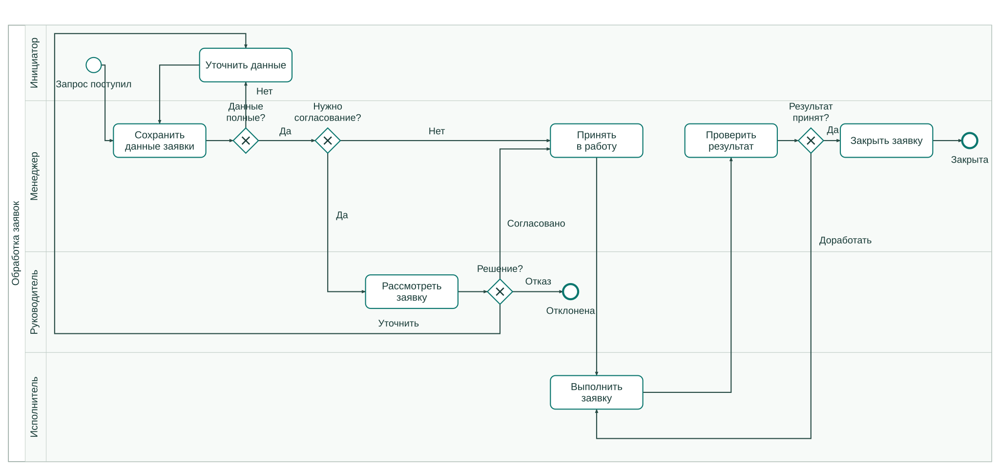

# Автоматизация обработки заявок в 1С: аналитическая спецификация

[English](README_EN.md)

Материалы основаны на задаче и исходных вводных автора. Подготовлены AS-IS/TO-BE, требования, интерфейсный макет, правила маршрутизации, SLA, матрица трассируемости и сценарии приёмки. Репозиторий показывает анализ и постановку задачи; готового расширения 1С, конфигурации или результатов внедрения здесь нет.

## Что смотреть

1. `01-business-context/scope.md` — границы задачи.
2. `02-process-analysis/input-requirements.md` — исходные потребности и вопросы к владельцу процесса.
3. `03-bpmn/to-be.drawio` / `to-be.svg` — предлагаемый маршрут с согласованием, отказом и возвратом на уточнение.
4. `06-specification/technical-specification.md` — состав доработки и нормативные правила текущей спецификации.
5. `06-specification/status-transitions.md` — разрешённые переходы, роли и эффекты.
6. `06-specification/sla-and-notifications.md` — рабочий календарь и повтор уведомлений.
7. `04-requirements/requirements-traceability-matrix.md` — покрытие всех FR и NFR сценариями.
8. `07-testing/test-scenarios.md` — конкретные ожидаемые результаты и статус проверок.



## Проверка доступных артефактов

Python 3.10–3.12, стандартная библиотека:

```bash
python -m unittest discover -s tests -v
```

`reference/sla.py` — проверяемая эталонная логика рабочего календаря и статусов на Python, а не реализация 1С. Тесты проверяют выходные, явные праздничные даты, границы дня, смену приоритета и запрет переходов. Приёмочные сценарии для формы, прав, уведомлений и производительности должны быть выполнены в целевой 1С после реализации; они помечены как ожидающие выполнения.

## Происхождение и ограничения

Данные и вводные принадлежат автору. Факт интервью, внедрение и измеренный эффект нельзя подтвердить только наличием документа. Числа 200 заявок/день и 3 дня обработки, ранее включённые в описание, не используются как доказанный результат: нужен период, источник и метод измерения. SLA 1/3/5 рабочих дней и календарь 09:00–18:00 — явно заданные правила текущей спецификации, которые нужно согласовать перед разработкой.

## Формулировка для резюме

«Подготовила аналитическую спецификацию автоматизации обработки заявок в 1С: описала текущий и целевой процессы, обязательные поля, маршруты согласования, SLA, роли и уведомления. Связала требования со сценариями приёмки; проверила эталонную логику календаря и переходов статусов».
