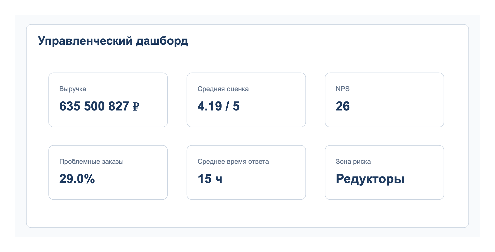
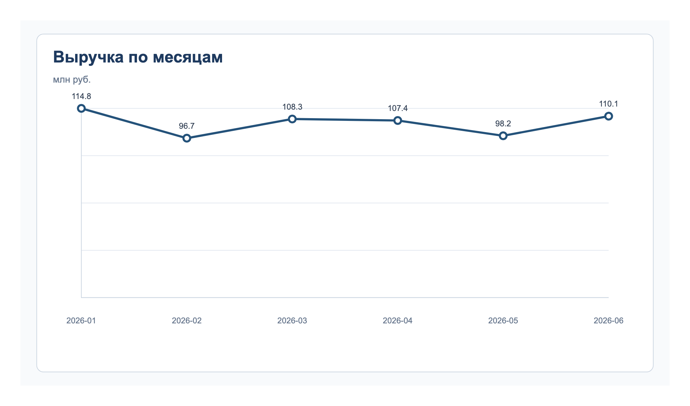
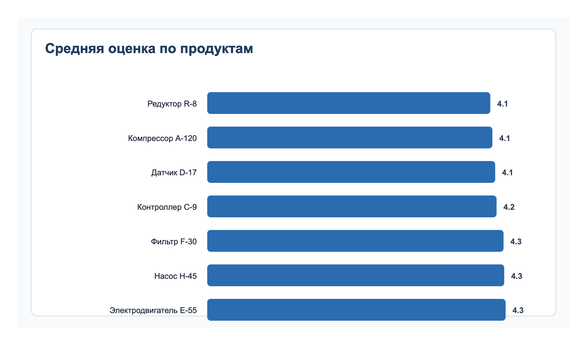
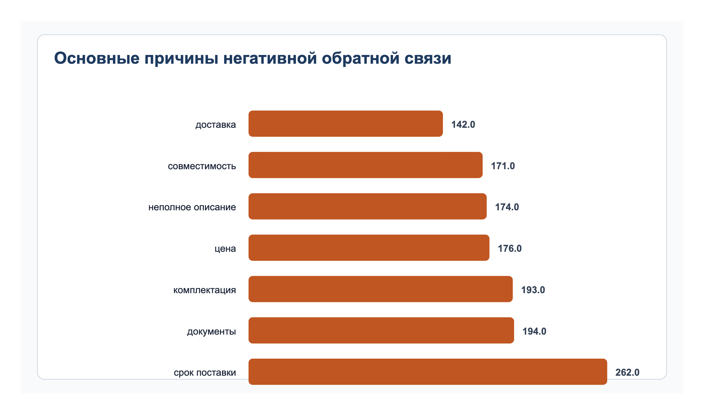
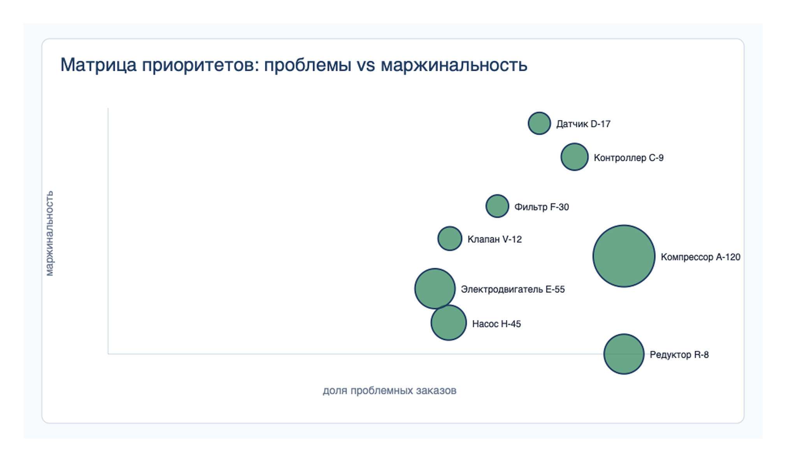

# Customer Feedback & Sales Analytics

Аналитический кейс на синтетических данных по анализу факторов удовлетворенности клиентов, продаж и клиентской обратной связи на Python. Сценарий приближен к типовой коммерческой задаче отдела продаж.

В проекте использован смоделированный набор данных, отражающий типичную структуру выгрузки отдела продаж.

## Бизнес-кейс

ООО "ПромСервис" продает промышленное оборудование и регулярно собирает обратную связь после завершения заказов. В последние два квартала выручка оставалась стабильной, однако количество негативных отзывов выросло, а доля повторных заказов начала снижаться.

Руководитель отдела продаж предполагает, что проблема может быть связана с отдельными категориями товаров, скоростью ответа менеджеров или повторяющимися причинами недовольства клиентов. Задача аналитика - исследовать данные и подготовить рекомендации для улучшения клиентского опыта.

## Ценность для бизнеса

Проект помогает:

- определить продукты, которые одновременно влияют на выручку и создают риск для клиентского опыта;
- выявить причины снижения повторных продаж;
- найти категории, где чаще появляется негативная обратная связь;
- сформировать приоритеты улучшений для отдела продаж и руководителя направления.

## Исходные данные

| Показатель | Значение |
|---|---:|
| Продажи | 4995 |
| Клиенты | 1903 |
| Менеджеры | 15 |
| Категории товаров | 8 |
| Период анализа | январь-июнь 2026 |
| Отзывы | 4995 |

## Цель исследования

- определить категории товаров с максимальной долей негативной обратной связи;
- найти продукты, где проблемы влияют на выручку и маржинальность;
- выявить связь между временем ответа и удовлетворенностью клиентов;
- подготовить рекомендации для повышения NPS и повторных продаж.

## Управленческий дашборд



Дашборд содержит:

- KPI-карточки по выручке, средней оценке, NPS, доле проблемных заказов и времени ответа;
- зону риска по категории товаров;
- графики по динамике выручки, оценкам продуктов и причинам обратной связи;
- матрицу приоритетов по маржинальности и доле проблемных заказов.

## Выполненные работы

- исследована структура исходных данных;
- выполнена очистка и стандартизация данных;
- проверены дубликаты, пропуски и период анализа;
- проведен исследовательский анализ;
- рассчитаны продуктовые и операционные метрики;
- исследована зависимость оценки клиента от времени ответа и категории товара;
- подготовлена матрица приоритизации по выручке, доле проблем и средней оценке;
- сформированы рекомендации для бизнеса.

## Ключевые цифры

| Метрика | Значение |
|---|---:|
| Заказы в выборке | 4995 |
| Выручка | 635 500 827 руб. |
| Средняя оценка | 4.19 из 5 |
| Адаптированный NPS | 26 |
| Заказы с проблемной обратной связью | 29.0% |
| Среднее время ответа | 14.6 ч |
| Продукт с максимальной долей проблем | Редуктор R-8 |

## Методика расчета адаптированного NPS

Оценка клиента хранится по шкале от 1 до 5. Для расчета адаптированного NPS шкала преобразована в группы:

- 5 - promoter;
- 4 - passive;
- 1-3 - detractor.

Формула: адаптированный NPS = (доля promoter - доля detractor) x 100.

Это адаптированный расчет для выгрузки с оценкой 1-5. В реальном проекте желательно использовать отдельный NPS-вопрос со шкалой 0-10.

## Основные выводы

- Самая частая причина негативной обратной связи - **срок поставки**.
- Наибольшая доля проблемных заказов у продукта **Редуктор R-8**.
- Две наиболее проблемные категории: **Редукторы** и **Компрессоры**.
- При ответе быстрее 12 часов средняя оценка клиента составляет **4.53**, при ответе дольше 24 часов - **3.42**.
- Продукты с высокой выручкой и высокой долей проблем требуют приоритета, потому что влияют и на деньги, и на повторные продажи.

## Рекомендации

- для `Редуктор R-8`: внедрить обязательную проверку срока поставки перед подтверждением заказа в ERP;
- ввести SLA на первый ответ по почтовому каналу;
- для `Компрессор А-120` подготовить шаблон ответа по причине `срок поставки` и обновить описание условий в коммерческом предложении;
- включить матрицу “маржинальность x доля проблемных заказов” в еженедельный отчет руководителя отдела продаж.

## Проверяемые гипотезы

| Гипотеза | Статус | Комментарий |
|---|---|---|
| Чем дольше время ответа, тем ниже оценка клиента | Подтверждена | 4.53 при ответе до 12 часов против 3.42 при ответе дольше 24 часов |
| Отдельные категории получают больше негативной обратной связи | Подтверждена | Наиболее проблемные категории: Редукторы и Компрессоры |
| Высокая выручка сама по себе означает высокий NPS | Не подтверждена | У `Компрессор А-120` высокая выручка, но продуктовый NPS составляет 19 |

## Использованные методы

- очистка данных;
- создание расчетных признаков;
- исследовательский анализ данных;
- агрегации и группировки в pandas;
- анализ связи между временем ответа и оценкой клиента;
- продуктовые метрики;
- клиентская сегментация;
- матрица приоритетов.

## Логика анализа

1. Проверка структуры данных: период, размер выборки, дубликаты заказов и пропуски.
2. Расчет ключевых KPI: выручка, прибыль, маржинальность, средняя оценка, NPS, доля проблемных заказов.
3. Продуктовый анализ: категории и продукты с высокой долей проблем, низкой оценкой и значимой выручкой.
4. Канальный анализ: сравнение каналов по времени ответа, оценке и доле проблем.
5. Анализ причин обратной связи: частота проблемы и выручка в зоне риска.
6. Проверка гипотезы о влиянии времени ответа на оценку клиента.
7. Матрица приоритетов для выбора действий руководителем отдела продаж.

## Ограничения исследования

- Использован смоделированный набор данных, отражающий типичную структуру выгрузки отдела продаж.
- Период анализа ограничен январем-июнем 2026 года.
- Сезонность отдельно не исследовалась.
- Анализ показывает паттерны в данных, но не доказывает причинно-следственную связь без дополнительной проверки.

## Процесс работы

| Этап | Результат |
|---|---|
| Бизнес-контекст | сформулированы цель и KPI исследования |
| Сбор данных | подготовлен смоделированный набор данных в формате CSV |
| Очистка | обработанные данные с расчетными полями |
| Анализ | продуктовые, клиентские и операционные метрики |
| Визуализация | управленческий дашборд и графики |
| Выводы | аналитическая записка и план действий |

## Результаты

| Артефакт | Файл |
|---|---|
| Бизнес-кейс | [01-business-context/business-case.md](01-business-context/business-case.md) |
| Цель и KPI | [01-business-context/kpi.md](01-business-context/kpi.md) |
| Исходные данные | [data/raw/sales_feedback_raw.csv](data/raw/sales_feedback_raw.csv) |
| Очищенные данные | [data/processed/sales_feedback_clean.csv](data/processed/sales_feedback_clean.csv) |
| Ноутбук анализа | [notebooks/sales_feedback_analysis.ipynb](notebooks/sales_feedback_analysis.ipynb) |
| Метрики по продуктам | [result/product_metrics.csv](result/product_metrics.csv) |
| План действий | [result/action_plan.csv](result/action_plan.csv) |
| Аналитическая записка | [result/analytics_summary.md](result/analytics_summary.md) |
| Описание данных | [docs/data_dictionary.md](docs/data_dictionary.md) |
| Зависимости для запуска | [requirements.txt](requirements.txt) |

## Как запустить

```bash
pip install -r requirements.txt
cd notebooks
jupyter notebook sales_feedback_analysis.ipynb
```

Ноутбук уже сохранен с выполненными ячейками и результатами расчетов, поэтому его можно просмотреть на GitHub без локального запуска.

## Ключевые графики










## Навыки

Python, pandas, EDA, очистка данных, расчет метрик, NPS, визуализация, аналитика клиентского опыта, формирование рекомендаций.

## Формулировка для резюме

Провела анализ факторов, влияющих на удовлетворенность клиентов и продажи: очистила выгрузку на Python, рассчитала продуктовые и операционные метрики, выявила проблемные категории, оценила связь времени ответа с оценкой клиента, подготовила управленческий дашборд и рекомендации для повышения NPS.
