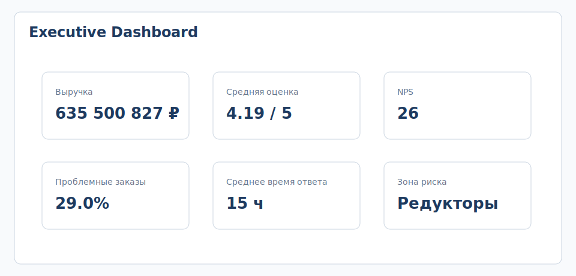
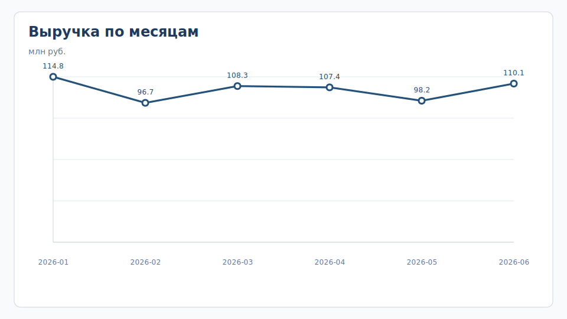
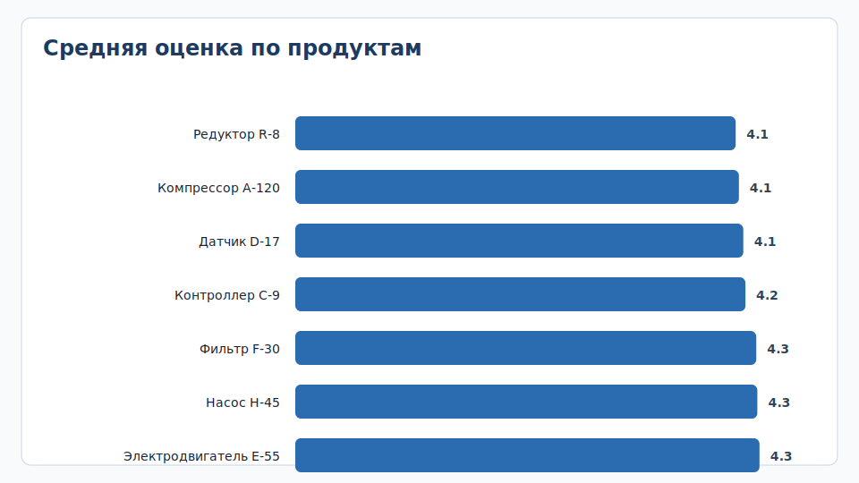
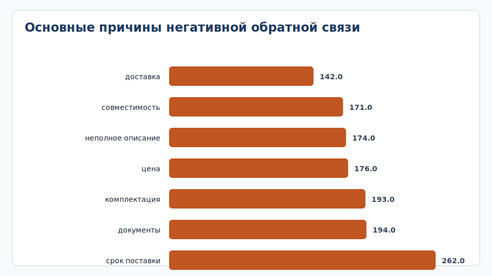
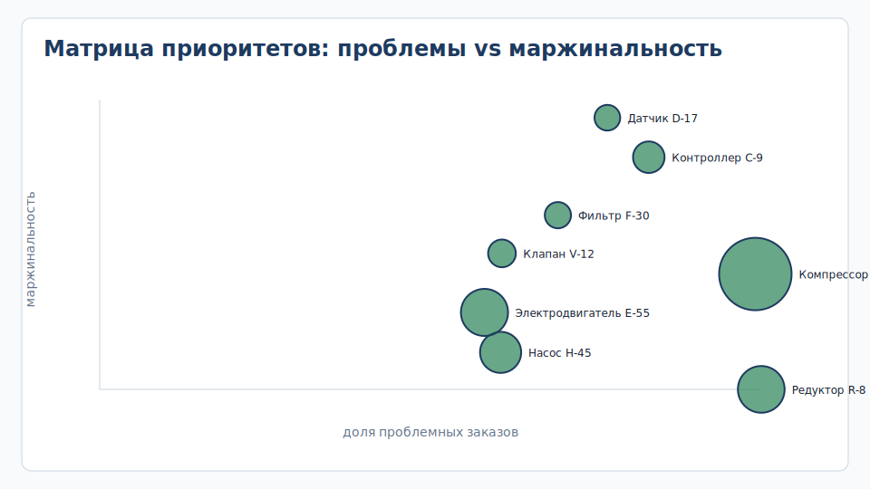

# Анализ факторов, влияющих на удовлетворенность клиентов и продажи

Компактный коммерческий кейс по Customer Experience Analytics: синтетическая выгрузка продаж и клиентской обратной связи обработана на Python, чтобы найти факторы, влияющие на удовлетворенность клиентов, NPS и повторные продажи.

## Бизнес-кейс

ООО "ТехСнаб" продает промышленное оборудование и регулярно собирает обратную связь после завершения заказов. В последние два квартала выручка оставалась стабильной, однако количество негативных отзывов выросло, а доля повторных заказов начала снижаться.

Руководитель отдела продаж предполагает, что проблема может быть связана с отдельными категориями товаров, скоростью ответа менеджеров или повторяющимися причинами недовольства клиентов. Задача аналитика - исследовать данные и подготовить рекомендации для улучшения клиентского опыта.

## Исходные данные

| Показатель | Значение |
|---|---:|
| Продажи | 4995 |
| Клиенты | 1903 |
| Менеджеры | 15 |
| Категории товаров | 8 |
| Период анализа | январь-июнь 2026 |
| Отзывы | 4995 |

## Цель исследования

- определить категории товаров с максимальной долей негативной обратной связи;
- найти продукты, где проблемы влияют на выручку и маржинальность;
- выявить связь между временем ответа и удовлетворенностью клиентов;
- подготовить рекомендации для повышения NPS и повторных продаж.

## Executive Dashboard

## Выполненные работы

- исследована структура исходных данных;
- выполнена очистка и стандартизация данных;
- проведен исследовательский анализ;
- рассчитаны продуктовые и операционные метрики;
- исследована зависимость оценки клиента от времени ответа и категории товара;
- сформированы рекомендации для бизнеса.

## Ключевые цифры

| Метрика | Значение |
|---|---:|
| Заказы в выборке | 4995 |
| Выручка | 635 500 827 руб. |
| Средняя оценка | 4.19 из 5 |
| NPS | 26 |
| Заказы с проблемной обратной связью | 29.0% |
| Среднее время ответа | 14.6 ч |
| Продукт с максимальной долей проблем | Редуктор R-8 |

## Основные выводы

- Самая частая причина негативной обратной связи - **срок поставки**.
- Наибольшая доля проблемных заказов у продукта **Редуктор R-8**.
- Две наиболее проблемные категории: **Редукторы** и **Компрессоры**.
- При ответе быстрее 12 часов средняя оценка клиента составляет **4.53**, при ответе дольше 24 часов - **3.42**.
- Продукты с высокой выручкой и высокой долей проблем требуют приоритета, потому что влияют и на деньги, и на повторные продажи.

## Рекомендации

- для `Редуктор R-8` разобрать причину `срок поставки` и добавить контрольный шаг перед передачей заказа клиенту;
- ввести SLA на первый ответ по почтовому каналу;
- для `Компрессор А-120` подготовить шаблон ответа по причине `срок поставки` и обновить описание в коммерческом предложении;
- раз в неделю смотреть матрицу “доля проблем x маржинальность”, чтобы выбирать фокус улучшений.

## Процесс работы

| Этап | Результат |
|---|---|
| Бизнес-контекст | сформулированы цель и KPI исследования |
| Сбор данных | подготовлена синтетическая CSV-выгрузка |
| Очистка | обработанные данные с расчетными полями |
| Анализ | продуктовые, клиентские и операционные метрики |
| Визуализация | executive dashboard и графики |
| Выводы | аналитическая записка и action plan |

## Результаты

| Артефакт | Файл |
|---|---|
| Бизнес-кейс | [01-business-context/business-case.md](01-business-context/business-case.md) |
| Цель и KPI | [01-business-context/kpi.md](01-business-context/kpi.md) |
| Исходные данные | [data/raw/sales_feedback_raw.csv](data/raw/sales_feedback_raw.csv) |
| Очищенные данные | [data/processed/sales_feedback_clean.csv](data/processed/sales_feedback_clean.csv) |
| Ноутбук анализа | [notebooks/sales_feedback_analysis.ipynb](notebooks/sales_feedback_analysis.ipynb) |
| Метрики по продуктам | [result/product_metrics.csv](result/product_metrics.csv) |
| План действий | [result/action_plan.csv](result/action_plan.csv) |
| Аналитическая записка | [result/analytics_summary.md](result/analytics_summary.md) |
| Описание данных | [docs/data_dictionary.md](docs/data_dictionary.md) |
| Зависимости для запуска | [requirements.txt](requirements.txt) |

## Ключевые графики

## Навыки

Python, pandas, EDA, очистка данных, расчет метрик, NPS, визуализация, customer experience analytics, формирование рекомендаций.

## Формулировка для резюме

Провела анализ факторов, влияющих на удовлетворенность клиентов и продажи: очистила выгрузку на Python, рассчитала продуктовые и операционные метрики, выявила проблемные категории, оценила связь времени ответа с оценкой клиента, подготовила executive dashboard и рекомендации для повышения NPS.
