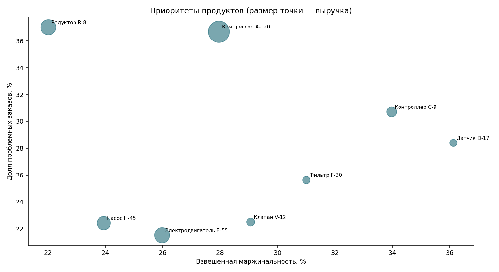

# Аналитика продаж и клиентской обратной связи

[English](README_EN.md)

Анализ собственных данных автора: 4 995 заказов и отзывов за январь—июнь 2026 года. Задача — сопоставить продажи, оценки 1–5, причины проблем и время ответа, затем определить направления для проверки первопричин.

## Что реализовано

- `src/analysis.py`: проверка схемы, пропусков, уникальности заказов и диапазонов значений; подготовка признаков; расчёт метрик; экспорт таблиц и графиков.
- Маржинальность продукта: сумма прибыли / сумма выручки. Индивидуальные проценты не усредняются.
- Баланс оценок: доля оценок 5 минус доля оценок 1–3, в процентных пунктах. Данные не содержат вопроса о рекомендации со шкалой 0–10, поэтому показатель не называется NPS.
- Единая приоритизация продуктов и плана действий: ранги выручки (0,4), доли проблем (0,4) и обратного ранга средней оценки (0,2). Веса — открытая эвристика, которую можно изменить в `WEIGHTS`.
- Описательное сравнение групп времени ответа с количеством заказов и приближёнными интервалами среднего. Нулевое время входит в первую группу.
- `notebooks/sales_feedback_analysis.ipynb` использует те же функции и показывает полный путь от исходного CSV до результатов.

## Воспроизведение

Python 3.10–3.12. Команды из корня репозитория:

```bash
python -m venv .venv
# Linux/macOS: source .venv/bin/activate
# Windows: .venv\Scripts\activate
python -m pip install -r requirements.txt
python src/analysis.py
python -m unittest discover -s tests -v
```

Для ноутбука дополнительно: `python -m pip install -r requirements-notebook.txt`, затем `jupyter notebook`. Ноутбук находит корень проекта при запуске из корня или папки `notebooks`.

Запуск обновляет `data/processed`, `result` и `screenshots`; `data/raw/sales_feedback_raw.csv` не перезаписывается. Ошибочный вход останавливает расчёт с сообщением. Ручное исправление источника и бизнес-правил остаётся решением автора, а не скрытой очисткой.

## Проверяемый результат

4 995 заказов; выручка 635 500 827 руб.; средняя оценка 4,19; доля заказов с зарегистрированной проблемой 29,01%. Контрольные значения проверяются тестами. Подробности — `result/analytics_summary.md`, `result/data_quality.csv`, `result/action_plan.csv`.



## Ограничения

Собственные данные автора не означают автоматически подтверждённое внедрение или измеренный эффект рекомендаций. Выручка и себестоимость берутся из исходных полей; скидка повторно не применяется. Доля возвратов рассчитывается отдельно: суммы возвратов для корректировки выручки нет. Нулевая выручка даёт недоступную маржу. Приближённые интервалы предполагают независимые наблюдения; повторные клиенты могут нарушать это условие. Различия между группами времени ответа не доказывают причинность. Повторные покупки и эффект действий на продажи здесь не исследуются.

## Как описать проект

«Проанализировала собственные данные по 4 995 заказам и клиентской обратной связи в Python/pandas. Настроила валидацию, рассчитала показатели продаж и качества обслуживания, построила графики и согласованный рейтинг продуктовых приоритетов. Оформила воспроизводимый запуск и обозначила ограничения интерпретации».
