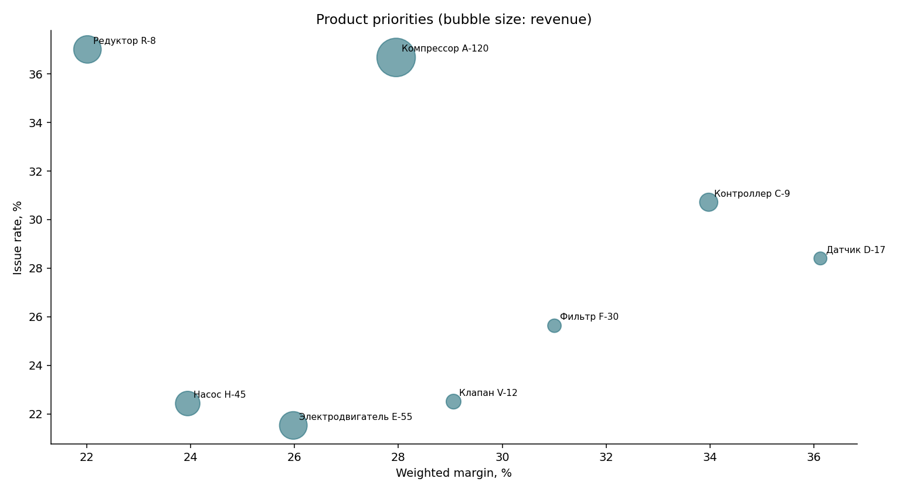

# Sales and customer feedback analytics

[Русский](README.md)

Analysis of the author's own data: 4,995 orders and feedback records from January–June 2026. The project relates revenue, 1–5 ratings, reported issues and response time to prioritise root-cause review.

## Implementation and reproducibility

Python 3.10–3.12. From the repository root:

```bash
python -m venv .venv
# Activate the environment for your operating system.
python -m pip install -r requirements.txt
python src/analysis.py
python -m unittest discover -s tests -v
```

For Jupyter: install `requirements-notebook.txt` and open `notebooks/sales_feedback_analysis.ipynb` from the root or notebooks directory. The notebook uses the same pipeline functions and rebuilds exports and charts.

`src/analysis.py` validates required fields, unique order IDs and numeric ranges. It preserves the raw CSV and updates processed data, result tables and charts. Product margin is total profit / total revenue. Rating balance is the share of 5 ratings minus the share of 1–3 ratings, in percentage points; it is not NPS. Priorities and the action plan use one documented rank-based heuristic: revenue 0.4, issue rate 0.4, inverse rating rank 0.2.

## Results and limits

4,995 orders; RUB 635,500,827 revenue; average rating 4.19; reported issue rate 29.01%. These are dataset totals, not a measured outcome of implementing recommendations. `result/analytics_summary.md` explains the descriptive findings.

Source revenue and cost are used without applying the discount again. Return amounts are unavailable, so return rate is reported separately. Zero revenue means unavailable margin. Approximate mean intervals assume independent observations; repeated customers may violate that assumption. Response-time comparisons do not establish causation. Repeat purchasing and intervention effects are not analysed.


