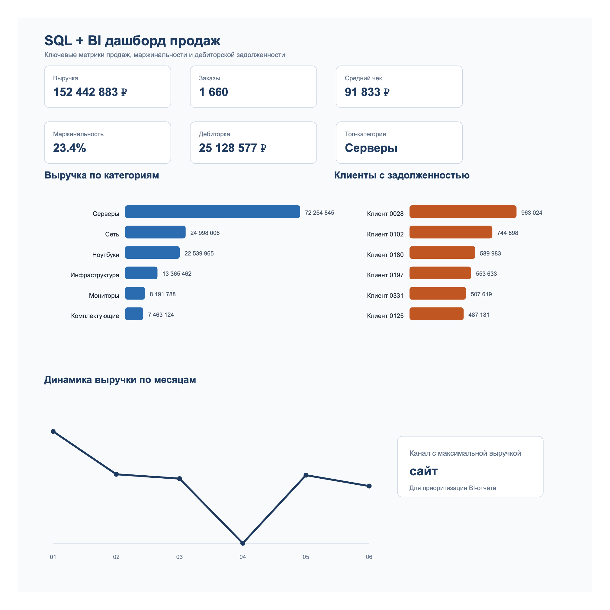

# Sales Performance SQL & BI Dashboard

Аналитический кейс на синтетических данных по SQL-аналитике и подготовке BI-дашборда для контроля продаж, маржинальности и дебиторской задолженности. Сценарий приближен к типовой коммерческой задаче интернет-магазина.

В проекте использован смоделированный набор данных, отражающий типичную структуру продаж интернет-магазина компьютерного оборудования.

## Бизнес-задача

Руководителю отдела продаж нужен регулярный отчет, который отвечает на вопросы:

- сколько компания продает и как меняется выручка по месяцам;
- какие категории и каналы дают основной вклад;
- где возникает дебиторская задолженность;
- какие метрики нужно вынести на управленческий дашборд.

## Бизнес-ценность

- сократить ручную подготовку управленческих срезов по продажам;
- видеть не только выручку, но и маржинальность и задолженность;
- быстро находить клиентов с риском неоплаты;
- сравнивать каналы продаж на единой SQL-модели;
- подготовить витрины данных для дальнейшего подключения к BI.

## Что сделано

- спроектирована SQL-модель из пяти таблиц;
- подготовлена SQLite-база данных;
- написаны SQL-запросы с JOIN, CTE, агрегациями и оконной функцией;
- рассчитаны KPI продаж, маржинальности и задолженности;
- подготовлены CSV-результаты для BI;
- собран макет управленческого дашборда;
- добавлен автономный HTML-прототип дашборда для демонстрации BI-логики без внешней платформы;
- описаны правила расчета метрик, фильтры и регламент обновления для BI-версии.

## Управленческий дашборд



Интерактивный прототип доступен онлайн: [Live demo](https://druzhinskaia.github.io/sales-performance-sql-bi-dashboard/dashboard/).

Локально прототип можно открыть через [dashboard/index.html](dashboard/index.html). Он показывает логику управленческого дашборда и фильтрации, но не заменяет промышленную BI-систему.

## Ключевые цифры

| Метрика | Значение |
|---|---:|
| Заказы | 1 660 |
| Выручка | 152 442 883 руб. |
| Средний чек | 91 833 руб. |
| Маржинальность | 23.4% |
| Дебиторская задолженность | 25 128 577 руб. |
| Топ-категория | Серверы |
| Топ-канал | сайт |

## Основные выводы

- Категория **Серверы** дает максимальную выручку: 72 254 845 руб.
- Канал **сайт** занимает первое место по выручке.
- Наибольшая задолженность у клиента **Клиент 0028**: 963 024 руб.
- Для руководителя важнее смотреть связку “выручка + маржинальность + задолженность”, а не только продажи.

## SQL-навыки

- проектирование реляционной модели;
- `JOIN` между заказами, товарами, клиентами и оплатами;
- `CTE` для промежуточных расчетов;
- агрегации по месяцам, категориям, каналам и клиентам;
- оконная функция `RANK()` для рейтинга каналов;
- подготовка выгрузок для BI-дашборда.

## Модель данных

| Таблица | Назначение |
|---|---|
| `customers` | клиенты, сегменты и регионы |
| `products` | товары, категории и целевая маржинальность |
| `orders` | заказы, даты, каналы и статусы |
| `order_items` | строки заказов, выручка и себестоимость |
| `payments` | оплаты, статусы оплаты и даты платежей |

## BI-логика

- продажи считаются только по неотмененным заказам;
- задолженность считается как разница между суммой заказа и оплаченной суммой;
- дашборд ориентирован на еженедельный управленческий контроль;
- для промышленной BI-версии предусмотрены фильтры по периоду, каналу, категории, региону, сегменту клиента и статусу оплаты.

## Структура проекта

| Артефакт | Файл |
|---|---|
| Бизнес-контекст | [docs/business_context.md](docs/business_context.md) |
| Модель данных | [docs/data_model.md](docs/data_model.md) |
| Метрики | [docs/metrics.md](docs/metrics.md) |
| SQLite-база | [data/retail_sales.db](data/retail_sales.db) |
| Исходные CSV | [data](data) |
| DDL | [sql/01_schema.sql](sql/01_schema.sql) |
| Загрузка данных | [sql/02_load_data.sql](sql/02_load_data.sql) |
| Аналитические запросы | [sql/03_analytics_queries.sql](sql/03_analytics_queries.sql) |
| Спецификация дашборда | [dashboard/dashboard_spec.md](dashboard/dashboard_spec.md) |
| Автономный HTML-прототип | [dashboard/index.html](dashboard/index.html) |
| Live demo | [GitHub Pages](https://druzhinskaia.github.io/sales-performance-sql-bi-dashboard/dashboard/) |
| Итоговые выгрузки | [result](result) |
| Аналитические выводы | [result/insights.md](result/insights.md) |

## Как проверить

База уже собрана в `data/retail_sales.db`. Запросы можно выполнить в SQLite:

```sql
.open data/retail_sales.db
.read sql/03_analytics_queries.sql
```

## Формулировка для резюме

Подготовила SQL + BI кейс для контроля продаж: спроектировала модель данных, собрала SQLite-базу, написала аналитические SQL-запросы с JOIN, CTE и оконной функцией, рассчитала KPI по выручке, маржинальности и дебиторской задолженности, подготовила выгрузки, спецификацию и интерактивный прототип управленческого дашборда.
